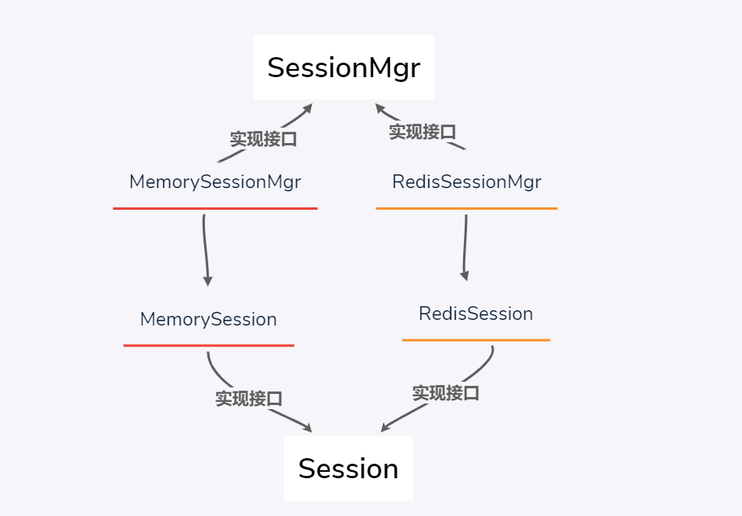

# 设计思路

## Session 接口设计

- Set()
- Get()
- Del()
- Save() //session 存储，redis 的实现延迟加载

## SessionMgr 接口设计

- init() //初始化,加载 redis 地址
- CreatSession() //创建一个新的 session
- GetSession() //通过 sessionID 获取对应的 session 对象

## MemorySession 设计

- 定义 MemorySession 对象（字段：sessionID；存 kv 的 map，读写锁）
- 构造函数 为了获取对象
- Set()
- Get()
- Del()
- Save()

## MemorySessionMgr 设计

- 定义 MemorySessionMgr 对象（字段：存放所有 session 的 map;读写锁）
- 构造函数
- init()
- CreatSession() //创建一个新的 session
- GetSession() //通过 sessionID 获取对应的 session 对象

## RedisSession 设计

- 定义 RedisSession 对象（字段：sessionID；存 kv 的 map，读写锁;redis 连接池；记录内存中 map 是否被修改的标记）
- 构造函数 为了获取对象
- Set() //将 session 存到内存中的 map
- Get() //取数据；实现延迟加载
- Del()
- Save()// 把 session 存到 redis

## RedisSessionMgr 设计

- 定义 RedisSessionMgr 对象（字段：redis 地址、redis 密码；连接池、存放所有 session 的 map;读写锁）
- 构造函数
- init()
- CreatSession()
- GetSession()

